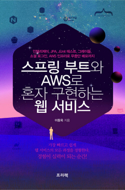
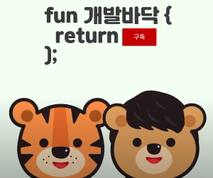
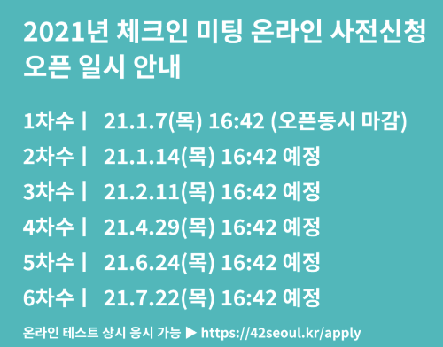

# 주니어 개발자를 위한 취업 정보

[Korean](./README.md) | [English](./README-en_EN.md) | [Chinese](./README-zh_CN.md)

> 이 저장소에 기여해주신 분들입니다.  
> 정말 감사합니다. :pray:

저의 첫 저서인 [스프링 부트와 AWS로 혼자 구현하는 웹 서비스](https://jojoldu.tistory.com/463)가 출간되었습니다.  
스프링부트와 AWS로 포트폴리오, 개인 프로젝트를 하고 싶으신 분들께 적극 추천드립니다.

개발자 지인과 함께 [유튜브 채널](https://bit.ly/3bNQ2hA)을 시작하였습니다.  
스타트업에서 개발자로 취업하고 일하는 것에 대해서 이런 저런 관점으로 이야기 해볼까 합니다.

여러분의 고민들 (취준생/주니어) 을 받아서 그에 대한 고민 상담도 같이 해보겠습니다 :)

## 1. 소개

주니어 개발자를 위한 **양질의 채용정보**가 흩어져있는 것 같아 한곳에 모으기 위한 저장소입니다.  
인턴/신입/주니어 채용 & 해커톤 일정을 담으려고 합니다.  
앞의 일정은 **서류 마감** 일정입니다.  
(혹시나 채용이 완료된 것이 확인되면 풀리퀘스트 부탁드립니다.)

## 2. PR 규칙

- 기간이 정해져 있지 않다면 **채용시까지**로 해주시면 됩니다.
- **db.json**도 함께 수정해주셔야 합니다.
  - db.json은 텔레그램 봇과 [co-duck 사이트](https://co-duck.com/)에서 **자동화**하기 위함입니다.
  - 이후 별도 사이트나 페이스북에서 자동화될 예정입니다.
  - db.json의 규칙은 `yyyy-MM-dd HH:mm:ss` 입니다.
  - 마감 일자만 있다면 시간은 `23:59:59` 로 해주세요.

## 3. 취업 관련 추천 링크

제 블로그에 있는 글 중 취업 관련 추천 글입니다.

- [3번째 직장에 오기까지](http://bit.ly/2sFSGim)
- [(2020) 1. 비전공자로 자바 백엔드 개발자 시작하기](https://jojoldu.tistory.com/505)

주니어 개발자분들에게 필요한 기술/세미나 등의 소식을 공유하는 페이스북 페이지

- [초보개발자모임](https://www.facebook.com/devbeginner/)

## 4. 채용 (2021)

채용에 올라온 기업들은 모두 **개발자로서 커리어 쌓기가 좋은 회사**의 **신입/주니어** 채용을 기준으로 합니다.

> 유의미한 트래픽이 발생하고,  
> 코드리뷰, 배포 자동화 등이 구축되어 있고,  
> 코드 품질에 관심이 있는 회사를 얘기합니다.

잡플래닛 평점 3.3 미만인 회사들은 PR을 주셔도 추가해드릴 수 없습니다.  
이 저장소의 목적은 **양질의 취업 정보를 한곳에 모으기 위함**입니다.  
**모든 회사의 채용 정보를 담으려는 것이 아닙니다**.  
잡플래닛 평점은 낮지만 정말 추천하고 싶은 회사가 있다면 그 사유를 같이 PR에 남겨주세요.

### 추천 기업 (마감일)

* [2021.04.12 09:00:00 ~ 2021.04.26 17:00:00] [2021 라인 광고 플랫폼 채용 연계형 인턴](https://careers.linecorp.com/ko/jobs/418?utm_source=junior-recruit-scheduler)
* [2021.04.20 09:00:00 ~ 2021.04.30 17:00:00] [2021 네이버웹툰 하계인턴십 채용연계형(개발/리서치)](https://recruit.webtoonscorp.com/webtoon/ko/job/detail?annoId=20005728)
* [2021.04.15 09:00:00 ~ 2021.05.03 17:00:00] [2021 카카오 채용 연계형 인턴](https://careers.kakao.com/jobs/P-11983?utm_source=junior-recruit-scheduler)
  
### 추천 기업 (수시 & 상시 채용)

- [채용시까지] [네이버 SmartEditor 백엔드 개발 채용연계형 인턴](https://recruit.navercorp.com/naver/job/detail/developer?annoId=20005215&utm_source=junior-recruit-scheduler)

- [채용시까지] [카카오 인프라 서비스 플랫폼 개발자 (경력 5년미만)](https://careers.kakao.com/jobs/P-11485?utm_source=junior-recruit-scheduler)

- [채용시까지] [토스팀 엔지니어 채용](https://toss.im/career/jobs?category=engineering-product&company=%ED%86%A0%EC%8A%A4%ED%8C%80)

  - [토스, 루머의 루머의 루머](https://youtu.be/HYxpv8a7I4I)

- [채용시까지] [AB180 엔지니어 영입중](https://abit.ly/ab180)
  - **1억 대의 디바이스. 100만 RPM. 하루 10억 건 이상의 이벤트 데이터**를 다루는 데이터 기업.  
    (GS SHOP 등 [100+ 개의 기업](https://abit.ly/ab180-clients)이 제품 사용중)
  - [어떤 문화와 동료를 지향하나요?](https://abit.ly/ab180-culture)
- [채용시까지] [네이버 동영상 플랫폼 (인턴)](https://recruit.navercorp.com/naver/job/detail/developer?annoId=20003170&utm_source=jojoldu/junior-recruit-scheduler)

* [상시채용] [모두의싸인 주니어 개발자 채용](https://www.notion.so/61da1be2959b40ae8621f1bdc44d605b?utm_source=junior-recruit-scheduler)

* [채용시까지] [토스팀 엔지니어 채용](https://toss.im/career/jobs?category=engineering-product&company=%ED%86%A0%EC%8A%A4%ED%8C%80)
  * [토스, 루머의 루머의 루머](https://youtu.be/HYxpv8a7I4I)

* [상시채용] [코드에프 주니어 경력 개발자 채용](https://www.notion.so/codef/fee06e9581f542a4898f803a9a601603)
  * [코드에프 서비스 소개](https://about.codef.io/#/)
  * [코드에프 문화 소개](https://www.notion.so/codef/24b49fbb14c746cb85c9bc090313c16e)

- [채용시까지] [당근마켓 백엔드/플랫폼 신입/인턴 채용](https://www.notion.so/07ca1fda22584d60a48ef43a8cf9bab0)
  - [기술 블로그](https://medium.com/daangn)
- [채용시까지] [버즈니 AI 백엔드/플랫폼 신입/경력 채용 (전문연구요원 가능)](https://recruit.buzzni.com/recruit/ai-lab-ai-%eb%b0%b1%ec%97%94%eb%93%9c-%ec%97%94%ec%a7%80%eb%8b%88%ec%96%b4-%ec%a0%84%eb%ac%b8%ec%97%b0%ea%b5%ac%ec%9a%94%ec%9b%90-%ea%b0%80%eb%8a%a5/)
  - [기술 블로그](https://buzzni.com/blog/)
- [채용시까지] [코멘토 Front-end 개발자 채용](https://www.notion.so/comento/Front-end-23adb41a65d34ca383d23f049f7b55b9)

  - [이재성 대표 인터뷰](https://ppss.kr/archives/207946)
  - [CTO 인터뷰](https://brunch.co.kr/@comento/120)
  - [프론트엔드 개발자 인터뷰](https://brunch.co.kr/@comento/117)

- [채용시까지] [스트리미 엔지니어 채용](https://github.com/gopax/Recruit)

- [채용시까지] [오일나우 웹 프론트 신입/경력 채용](https://www.notion.so/91f036e4b22041dd866682fea7516140)

  - [오일나우 팀 블로그](https://medium.com/%EC%98%A4%EC%9D%BC%EB%82%98%EC%9A%B0-%ED%8C%80-%EB%B8%94%EB%A1%9C%EA%B7%B8)

- [채용시까지] [스켈터랩스 소프트웨어 엔지니어 채용](https://www.notion.so/71edafe219b0432da0b1959f622c9f1a)
  - AI 전문 인력이 아니더라도 인터뷰에는 전혀 지장이 없으며, 전문 연구 요원도 상시 채용하고 있습니다.
  - [스켈터랩스 CEO 인터뷰](https://www.youtube.com/watch?v=uIhKDGz2ENo&t=349s)
  - [스켈터랩스 팀 문화 소개](https://blog.naver.com/skelterlabs/221860320455)
  - [스켈터랩스 뉴스](https://www.skelterlabs.com/ko/news/)

### 채용 관련 행사 & 교육 코스

채용과 관련된 프로그래밍 대회, 교육 코스, 해커톤 일정, 세미나 등을 포함합니다.

- [2021.01.14 16:42:00 ~ 2021.07.22 16:42:00 (선착순)] [2021년도 42 SEOUL 모집](https://innovationacademy.kr/notice?board=4&post=104&utm_source=jojoldu/junior-recruit-scheduler)
  - [선발 프로세스](https://42seoul.kr/admission)
  - [지원 방법](https://42seoul.kr/apply)

- [2021.04.28 09:00:00 ~ 2021.05.06 13:00:00] [2021 우아한테크캠프 4기 모집](https://woowabros.github.io/devrel/2021/04/20/woowa-techcamp_4th.html)

### 이외 채용정보 얻는 법

**잡코리아, 사람인 채용 정보는 개인적으로는 추천하지 않습니다**.  
추가로 채용 정보에 복사 & 붙여넣기 한 듯한 양식이나 글이 있다면 거르셔도 됩니다.  
그만큼 **채용에 관심이 없는 회사라면 개발자에 대한 인식도 부족**하다고 보셔야 합니다.  
아래는 제가 정기적으로 방문하는 잡플래닛/원티드 검색 조건입니다.  
참고하시면 좋을 것 같습니다.

- [잡플래닛 신입 개발자 채용 리스트](https://www.jobplanet.co.kr/job_postings/search?utf8=%E2%9C%93&query=&jp_show_search_result=true&jp_show_search_result_chk=true&occupation_level2_ids%5B%5D=11610&occupation_level2_ids%5B%5D=11604&occupation_level2_ids%5B%5D=11603&industry_level2_ids%5B%5D=709&industry_level2_ids%5B%5D=702&recruitment_type_ids%5B%5D=1&order_by=score&page=1)
- [원티드 신입 개발자 채용 리스트](https://www.wanted.co.kr/wdlist/518?referer_id=23685&years=0)
- [로켓펀치 '병역대체' 채용 리스트](https://www.rocketpunch.com/jobs?military_service=1&q=)

## 5. 신입 개발자 구직 팁

**취업 팁 외에 다른 팁은 포함하지 않습니다.**  
주니어를 위한 각종 팁은 [페이스북 페이지](https://www.facebook.com/devbeginner/)를 참고해주세요.

### 카카오 코딩 테스트 문제 해설

- [2021] 카카오 신입 공채 코딩 테스트 [1차](https://tech.kakao.com/2021/01/25/2021-kakao-recruitment-round-1/) 해설

- [2020] 카카오 신입 공채 코딩 테스트 [1차](https://tech.kakao.com/2019/10/02/kakao-blind-recruitment-2020-round1/), [2차](https://tech.kakao.com/2019/10/21/2020-카카오-블라인드-공채-2차-오프라인-코딩-테스트-문/) 해설
- [2019] 카카오 신입 공채 코딩 테스트 [1차](http://tech.kakao.com/2018/09/21/kakao-blind-recruitment-for2019-round-1/), [2차](http://tech.kakao.com/2018/10/23/kakao-blind-recruitment-round-2/) 해설

- [2018] 카카오 코드 페스티벌 [예선전](http://tech.kakao.com/2018/08/09/code-festival-2018-round-1/), [본선](http://tech.kakao.com/2018/09/12/code-festival-2018-round-2/) 해설

- [2018] 카카오 블라인드 코딩테스트 [1차](http://tech.kakao.com/2017/09/27/kakao-blind-recruitment-round-1/), [2차](http://tech.kakao.com/2017/10/24/kakao-blind-recruitment-round-2/), [3차](http://tech.kakao.com/2017/11/14/kakao-blind-recruitment-round-3/) 해설

- [2017] 카카오 코드 페스티벌 [예선전](http://tech.kakao.com/2017/08/11/code-festival-round-1/), [본선](http://tech.kakao.com/2017/09/13/code-festival-round-2/) 해설

### 구직 전반

- [쟈미님의 공채없이 카카오 개발자 취준기](https://jyami.tistory.com/126)

- [원티드와 함께하는 개발자 커리어 터치 참석 후기](https://velog.io/@doondoony/후기-원티드와-함께하는-개발자-커리어-터치)

- [MS Imagine Cup 국가대표의 스타트업 도전기 - 창업 실패부터 현재 커리어를 만들기까지 - 참석후기](https://jojoldu.tistory.com/423)

- [마음에 안드는 중소기업에 합격했을때](https://jojoldu.tistory.com/398)

- [Tech HR - 주니어 개발자와 시니어 개발자의 차이 필독](https://jojoldu.tistory.com/163)

- [OKKY 취준생 Q&A Meet-up 세미나 후기](http://bit.ly/2P8afUH)

- [제로 스펙에 가까웠던 듣보잡 개발자의 유명 IT 기업 도전기](http://bit.ly/2yqiH7V)

- [이종립(aka. 기계인간)님의 SI탈출하기 세미나 by OKKY](http://bit.ly/2LAkFqL)

- [김은향님의 신입 개발자 이야기](https://www.slideshare.net/EunhyangKim2/ss-87782520)

- [진유림님의 이직 이야기](https://milooy.wordpress.com/2018/02/07/moving-job/)

- [이한별님의 구직 이야기](http://lhb0517.tistory.com/entry/reviewofjojoldu)

- [변성윤님의 Gap Year 및 쏘카 이직 이야기](https://zzsza.github.io/diary/2018/10/26/gap-year-and-socar/)

- [원티드와 함께하는 개발자 커리어 터치](https://www.notion.so/8a5fb590ae204295adf8117b5f58e32e)

- [28세 요우님의 개발자 이직 대탐험](http://luckyyowu.tistory.com/382)

- [강디너의 이직 탐험기](https://kdinner.tistory.com/58)

- [sizplay의 주니어 프론트엔드 개발자 이직 팁](https://www.sizplay.dev/Interview/주니어-프론트엔드-개발자-이직-팁/)

### 이력서 & 포트폴리오 작성법

- [정원희님의 개발자 이력서 작성하기](https://wonny.space/writing/work/engineer-resume)

- [원티드랩에서 이야기하는 통과가 잘 되는 이력서 작성법 (신입/경력 포함)](https://brunch.co.kr/@wantedlab/29)

- [이민석 교수님의 신입 개발자 자기소개서 작성법](http://hl1itj.tistory.com/90)

- [seungdols님의 신입 자소서 작성법](https://brunch.co.kr/@seungdols/11)

- [Outsider님의 이력서](https://blog.outsider.ne.kr/1234)

- [우아한형제들 구인본님 - 이직 초보 어느 개발자의 이력서 만들기](http://woowabros.github.io/experience/2017/07/17/resume.html)

- [마르코님의 번역 - 2017년 개발자 이력서 작성 가이드](https://brunch.co.kr/@imagineer/215)

- [권희정님의 개발자의 포트폴리오 ・ 이력서 작성법](https://gmlwjd9405.github.io/2018/05/04/how-to-write-a-resume-for-a-developer.html)

- [JSpiner님의 github로 다같이 쓰는 이력서](https://github.com/JSpiner/RESUME)

- [sizplay의 주니어 프론트엔드 개발자 이력서 작성 팁](https://www.sizplay.dev/Interview/주니어-프론트엔드-개발자-이력서-작성-팁/)

- [minieetea님의 잘 정리된 이력서보다 중요한 것](https://minieetea.com/2021/04/archives/6193)

### 면접 팁

- [JBee(한재엽)님의 기술면접 자료 Repository](https://github.com/JaeYeopHan/Interview_Question_for_Beginner)

- [김태곤님의 신입 프론트엔드 개발자를 위한 면접 조언](https://taegon.kim/archives/5770)

- [너굴너굴님의 좋은면접자/지원자 되는 방법](https://repo.yona.io/doortts/blog/post/292)

- [네이버 면접 시 듣게 되는 41가지 질문(기사)](http://www.bloter.net/archives/245110)

- [카카오 면접 시 듣게 되는 70가지 질문(블로터)](http://www.bloter.net/archives/245529)

- [애플 면접에서 듣게 되는 33가지 질문(기사)](http://www.bloter.net/archives/244910)

- [초보팀장의 일기 - 면접을 볼 때마다 하는 질문들](https://web.archive.org/web/20170420162138/http://blog.java2game.com/401)

- [Awesome Interview Questions - GitHub](https://github.com/MaximAbramchuck/awesome-interview-questions)

- [개발자를 채용하면서 느꼈던 것들](http://sungjk.github.io/2017/06/11/interview-guide.html)

- [이번 기술 면접 중 기억나는 질문과 답변들 (프론트엔드)](https://medium.com/@jimkimau/이번-기술-면접-중-기억나는-질문과-답변들-712daa9a2dc)

- [변성윤님의 Datascience-Interview-Questions](https://github.com/zzsza/Datascience-Interview-Questions)

- [1년 동안 면접을 보며 만났던 질문 리스트 (기술)](https://github.com/KimHunJin/Study-Book/tree/master/interview)

- [직접 경험을 통해 추려낸 공통 질문](https://github.com/KSH-code/Technical-Interview/blob/master/README.md)

- [WeareSoft의 기술면접 자료 Repository](https://github.com/WeareSoft/tech-interview)

- [30개 기업에서 받은 신입 면접 질문&답변](https://github.com/jobhope/TechnicalNote)

### 기타 정보

- [개발자 채용시 기술검증 어떻게 할 것인가 - 세미나 후기](http://bit.ly/2QDKlWs)
- [2016 KSUG 경력 관리 세미나](http://bit.ly/2JEexjS)
- [프로그래머의 삶님의 IT 분야의 개발자로 취업할 때 실수하는 몇 가지](http://coderlife.tistory.com/88)
- [나무위키 SI](https://namu.wiki/w/SI)
- [피해야 하는 중소기업 거르는 꿀팁](http://principlesofknowledge.kr/archives/31414)

- [Java Interview Question (영문)](https://www.javatpoint.com/corejava-interview-questions)
- [Java 8 Interview Question (영문)](https://www.interviewbit.com/java-8-interview-questions/)

### 추천 도서

- [프로그래밍 면접 이렇게 준비한다](https://book.naver.com/bookdb/book_detail.nhn?bid=15064639)
  - [요약정리](https://www.slideshare.net/ddayinhwang9/ss-60152650)
