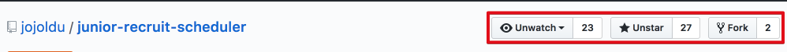

# 주니어 개발자를 위한 취업 정보

주니어 개발자를 위한 **양질의 채용정보**가 흩어져있는것 같아 한곳에 모으기 위한 저장소  
인턴/신입/주니어 채용 & 해커톤 일정을 담으려고 합니다.  
앞의 일정은 **서류 마감** 일정입니다.  
(혹시나 채용이 완료된 것이 확인되면 풀리퀘스트 부탁드립니다.)  

## 피드 받는 법

우측 상단의 버튼들 중

* Watch : 저장소 변경에 대한 실시간 피드
* Star : 제작자에게 버프를, 하신분께선 즐겨찾기 등록이 되는 기능
* Fork : 개인 저장소로 복제, 하지만 현재 저장소가 업데이트 되는것이 반영 안되므로 정보만 받으려면 불필요 (대신 풀리퀘스트를 보내야할 경우 Fork하여 브랜치 생성 -> 커밋&푸시 -> 풀리퀘스트가 가능함)

## 신입 개발자 구직 팁

구직 팁 외에 다른 팁은 담지 않으려고 합니다.  
주니어를 위한 팁으로 범위를 정하면 너무 커져버리기 때문에 제한하였습니다.    
주니어를 위한 각종 팁은 [페이스북 페이지](https://www.facebook.com/devbeginner/)를 참고해주세요

* [김남윤님의 신입 개발자 취업 도전기](https://www.slideshare.net/ssuser565d51/ss-61448739)
* [김태곤님의 신입 프론트엔드 개발자를 위한 면접 조언](https://taegon.kim/archives/5770)
* [너굴너굴님의 좋은면접자/지원자 되는 방법](https://repo.yona.io/doortts/blog/post/292)
* [OKKY "마음까지전하는"님의 웹개발자 신입 구직 팁](https://okky.kr/article/314704)
* [OKKY "roggy"님의 신입 개발자 이력서 작성 요령](https://okky.kr/article/319687)
* [OKKY "load2000"님의 포트폴리오 작성 팁](https://okky.kr/article/368504)
* [이민석 교수님의 신입 개발자 자기소개서 작성법](http://hl1itj.tistory.com/90)
* [Outsider님의 이력서](https://blog.outsider.ne.kr/1234)
* [프로그래머의 삶님의 IT 분야의 개발자로 취업할 때 실수하는 몇 가지](http://coderlife.tistory.com/88)
* [jerome님의 포털(네이버, 다음, 줌 등)에 지원하는 신입공채 개발자들의 자기소개서 작성 팁](http://jerome75.tistory.com/2)
* [나무위키 SI](https://namu.wiki/w/SI)

## 채용 (2017)

* [05.15 ~ 05.19] [우아한 형제들 개발 인턴](https://recruit.woowahan.com/#/techcamp)

* [05.08 ~ 05.19 17:00] [NHN엔터테인먼트(구 한게임) 게임 개발 신입](http://recruit.nhnent.com/ent/recruitings/20000537)

* [05.01 ~ 05.20 12:00] [스타트업 인턴 프로그램 (프로그램스, 토스, 8퍼센트, 리디북스 등)](https://programmers.co.kr/competitions/18/summercoding-%EC%97%AC%EB%A6%84%EB%B0%A9%ED%95%99-%EC%8A%A4%ED%83%80%ED%8A%B8%EC%97%85-%EC%9D%B8%ED%84%B4-%ED%94%84%EB%A1%9C%EA%B7%B8%EB%9E%A8)

* [05.08 ~ 05.21] [NHN엔터테인먼트 Bugs 웹/IOS 개발 신입](https://recruit.nhnent.com/ent/recruitings/20000534
)

* [04.28 ~ 05.24] [NTS SW 개발 인턴](http://recruit.nts-corp.com/recNotice.do?pageAction=getRecCatList)

* [05.15 ~ 05.26] [네이버 여름 인턴](./네이버여름인턴.md)

* [05.16 ~ 06.06] [네이버커넥트 부스트캠프](http://boostcamp.connect.or.kr/recruit.html)

* [05.08 ~ 06.13 09:00] [알피지코리아(요기요) 인턴](https://rgpkorea.recruiter.co.kr/app/jobnotice/view?systemKindCode=MRS1&jobnoticeSn=9117)
* [채용시까지] [카카오/다음](https://careers.kakao.com/jobs) 
  * [사내정보 시스템 개발](https://careers.kakao.com/jobs/P-9336?part=TECHNOLOGY&page=1&company=KAKAO)
  * [카카오톡 안티 어뷰징 개발](https://careers.kakao.com/jobs/P-10098?part=TECHNOLOGY&page=2&company=KAKAO)
  * [키워드광고/부동산플랫폼 개발](https://careers.kakao.com/jobs/P-10004?part=TECHNOLOGY&page=4&company=KAKAO)
  * [다음 카페 서비스 서버 개발](https://careers.kakao.com/jobs/P-10084?part=TECHNOLOGY&page=5&company=KAKAO)
  * [다음 앱 (Android/iOS) 개발](https://careers.kakao.com/jobs/P-10051?part=TECHNOLOGY&page=5&company=KAKAO)
* [채용시까지] [줌인터넷](http://www.estsoft.co.kr/Default.aspx?wbs=5.0.3&sg1=&sg2=&sg3=&sg=&occupation=dev)
  * [머신러닝(딥러닝)을 활용한 검색 신기술 개발](http://www.estsoft.co.kr/Default.aspx?wbs=5.0.3.5&rcrtid=R201704140001)

## 해커톤 (2017)

구직 중인 신입 개발자들의 취업에 큰 도움이 될 해커톤 정보도 포함했습니다. ([JBee 한재엽](https://github.com/JaeYeopHan)님 감사합니다.)
